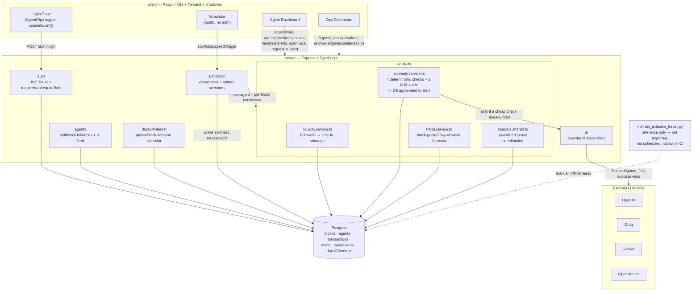
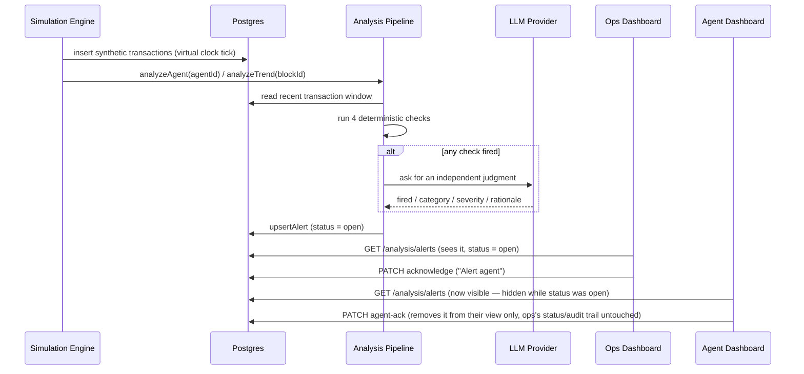

# Architecture

ShongCaught is two independent npm packages (`server/`, `client/`) plus a standalone,
not-wired-in `ml/` reference script — no shared workspace, no shared code. See `CLAUDE.md` for
file-level detail and `flow.md` for a feature-by-feature walkthrough.

## System overview

**Why this shape:** the simulation engine is the only thing that writes transactions, so it's
the sole trigger for analysis — nothing polls or schedules separately. The analysis module
never calls an AI provider unless a cheap deterministic check already fired (an LLM vote alone
can never reach the 2-of-5 threshold), which is what keeps LLM spend and rate-limit exposure
bounded. `ml/` is drawn with a dashed line deliberately — it's a reference sketch from a design
discussion, not a live dependency.

## Alert lifecycle (liquidity/anomaly detection → case coordination)

This is the same loop for all three alert types (`liquidity`, `anomaly`, `trend`) — the only
difference is what triggers `upsertAlert` and whether `agentId` is set (`trend` alerts are
`agentId: null`, block-scoped, visible to every agent in that block once ops acts on them).

## Data model

`blocks` (operational areas) → `agents` (shop entities, distinct from `users`/login accounts) →
`agentProviderBalances` (one row per agent per provider) → `transactions` (the event log
everything derives from) → `alerts` (liquidity/anomaly/trend, with evidence/confidence/status/
owner) → `caseEvents` (the full audit trail: created, acknowledged, escalated, resolved, agent
notes). `daysOfInterest` is a separate, human-curated calendar that biases simulation
generation directly, independent of the statistical `trend` forecaster.
